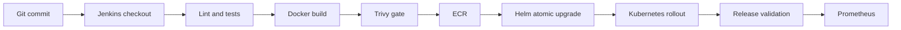

# ForgePulse Delivery

**A Jenkins-first release pipeline with verifiable Kubernetes deployments.**

[](https://github.com/micky1411/forgepulse-delivery/actions/workflows/ci.yml)

ForgePulse shows the complete path from commit to a validated Kubernetes release. Jenkins is the primary orchestrator; GitHub Actions provides pull-request quality checks. Every running API instance reports its application version, Git SHA, and environment so deployment validation checks evidence instead of assuming success.

## Pipeline



## What makes it production-style

- Declarative Jenkins pipeline with concurrency protection, timeout, retained test reports, security scanning, and failure diagnostics.
- FastAPI service with health endpoints, release provenance, and Prometheus metrics.
- Immutable Git-SHA image tags and an atomic Helm upgrade that rolls back on failed readiness.
- Non-root container and Kubernetes runtime security controls.
- Terraform-managed encrypted ECR and versioned build-artifact storage.
- GitHub Actions fallback quality gate for pull requests.
- Argo CD manifest demonstrating an alternate GitOps operating model.

## Local quick start

```powershell
python -m venv .venv
.venv\Scripts\Activate.ps1
python -m pip install -e ".[dev]"
pytest -q
docker compose up -d --build
Invoke-RestMethod http://localhost:8080/release
```

## Rollback drill

```powershell
helm history forgepulse -n forgepulse-dev
helm rollback forgepulse 1 -n forgepulse-dev --wait
kubectl rollout status deployment/forgepulse -n forgepulse-dev
```

AWS and Kubernetes credentials are never stored in this repository. See [the Jenkins setup guide](docs/jenkins-setup.md) before connecting a real controller.

## Ownership

Designed and maintained by [micky1411](https://github.com/micky1411).
